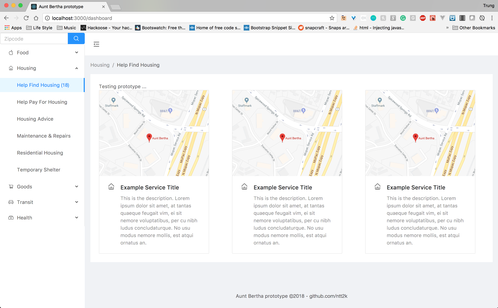

# Aunt_Bertha

Show basic Aunt Bertha prototype 2018.
How to setup at root folder, run follow commands (have yarn installed first with npm): 

```bash
yarn install
```

```bash
yarn start
```
#### Overall architect
#### Front-end:
- [x] React, React Router, Ant-design pattern (completed)
- [ ] *TODO: Implement google_map_reacts into existence card web component. (in process)

#### Back-end:
- [ ] Implement back-end to capture direct live data from [auntbertha.com](http://auntbertha.com "auntbertha.com")
- [ ] *TODO: Implement Python back-end services + containerize application with Docker ... (in process)



{:height="50%" width="50%"}
{:height="50%" width="50%"}