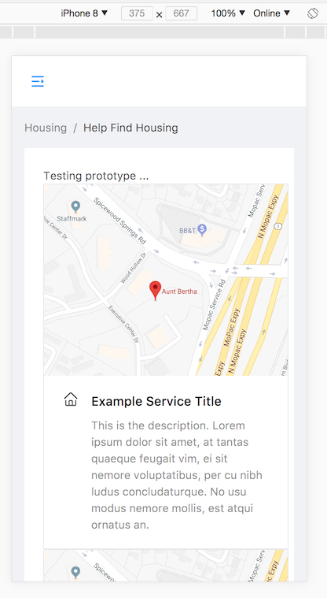

# Aunt_Bertha

Show basic Aunt Bertha prototype 2018.
How to setup at root folder, run follow commands (have yarn installed first with npm): 

yarn install

yarn start

*TODO: Implement backend services + containerize with Docker ... (in progress)

{:height="50%" width="50%"}
{:height="50%" width="50%"}